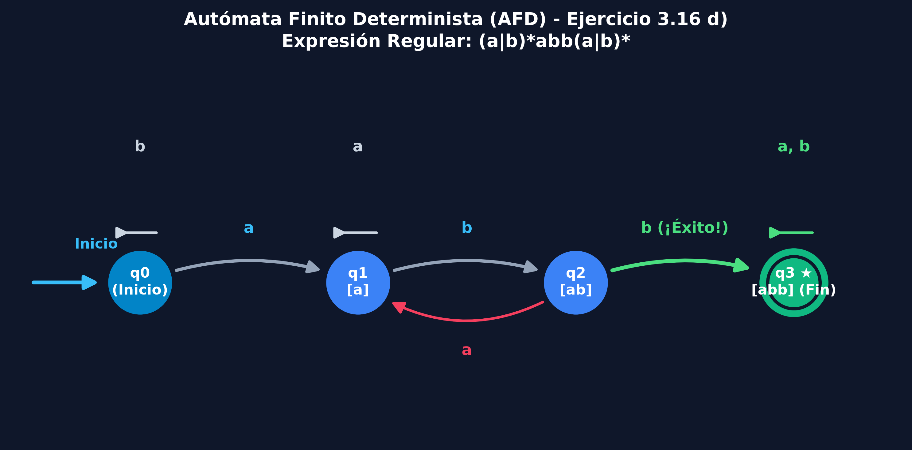
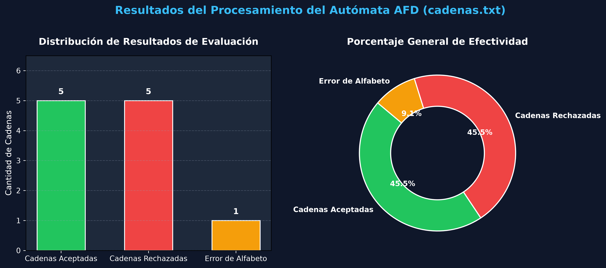

## 1. Introducción

La tarea consiste en el desarrollo e implementación de un simulador genérico de **Autómatas Finitos Deterministas (AFD)** escrito en Python (`AFD.py`). El simulador permite configurar cualquier autómata mediante un archivo de texto de configuración (`conf.txt`) y evaluar secuencialmente un conjunto de cadenas de entrada provistas en `cadenas.txt`.

Para validar el funcionamiento del autómata, se toman como caso de estudio los modelos del **ejercicio 3.16 (página 149)** del libro *Compiladores: Principios, Técnicas y Herramientas* de Alfred V. Aho. El programa determina si cada cadena pertenece al lenguaje formal aceptado por el autómata y genera la secuencia completa de movimiento.

---

## 2. Fundamento teórico

### 2.1 Definición del automata

Un **AFD** es un modelo matemático de computación que reconoce lenguajes regulares. Formalmente, un AFD se define como una **quíntupla**:

$$A = (Q, \Sigma, f, q_0, F)$$

Donde:
* **$Q$**: Conjunto finito de estados ($Q = \{q_0, q_1, \dots, q_n\}$).
* **$\Sigma$**: Alfabeto de entrada (conjunto finito de símbolos permitidos).
* **$f : Q \times \Sigma \to Q$**: Función total de transición, la cual asigna a cada par (estado actual, símbolo leído) un único estado siguiente.
* **$q_0 \in Q$**: Estado inicial desde el cual comienza el procesamiento de la cadena.
* **$F \subseteq Q$**: Conjunto de estados finales o de aceptación.

```
                  ┌───────────────────────────────┐
                  │    Entrada: símbolo (a ∈ Σ)   │
                  └───────────────┬───────────────┘
                                  │
                                  ▼
┌──────────────────┐      ┌───────────────┐      ┌──────────────────┐
│  Estado actual   ├─────►│   Función f   ├─────►│ Estado siguiente │
│     (q ∈ Q)      │      │ (Q x Σ ──► Q) │      │     (q' ∈ Q)     │
└──────────────────┘      └───────────────┘      └──────────────────┘
```

### 2.2 Determinismo vs. No determinismo (AFD vs. AFND)
En un autómata determinista (**AFD**), para un estado $q$ y un símbolo $a$, existe **exactamente una única transición** $f(q, a) = q'$. No existen ambigüedades ni transiciones vacías ($\epsilon$). En contraste, un autómata no determinista (**AFND**) puede tener múltiples caminos posibles o transiciones $\epsilon$. 

El **Algoritmo de Thompson** (mencionado como Algoritmo 3.3 en la literatura de Aho) permite construir un AFND a partir de una expresión regular, el cual posteriormente se convierte a un **AFD equivalente** mediante la
construcción de subconjuntos.

---

## 3. Análisis del ejercicio

El ejercicio solicita construir autómatas y mostrar la secuencia de movimientos al procesar la cadena de entrada **`ababbab`** para las siguientes expresiones regulares:

1. **a)**: $(a \mid b)^*$
   * Acepta cualquier combinación de $a$ y $b$, incluyendo la cadena vacía $\epsilon$. Es el lenguaje universal sobre $\Sigma = \{a, b\}$.
2. **b)**: $(a^* \mid b^*)^*$
   * Equivalente a la expresión del inciso a), acepta cualquier secuencia de $a$ y $b$.
3. **c)**: $((\epsilon \mid a) b^*)^*$
   * De igual forma, genera cualquier cadena sobre el alfabeto $\{a, b\}^*$.
4. **d)**: $(a \mid b)^* a b b (a \mid b)^*$
   * Es el autómata de patrón estructurado. Acepta todas las cadenas sobre $\{a, b\}$ que contienen la subcadena continua **`abb`**.

### Autómata determinista para el inciso d) $(a \mid b)^* a b b (a \mid b)^*$

Para detectar la subcadena `abb`, el autómata requiere 4 estados con las siguientes funciones de memoria:
* **$q_0$**: Estado inicial. No se ha detectado ningún prefijo de `abb`.
* **$q_1$**: Se ha leído el primer carácter `'a'`.
* **$q_2$**: Se ha leído la secuencia `'ab'`.
* **$q_3$**: Estado final / aceptación ($F = \{q_3\}$). Se ha leído la subcadena `'abb'`. Una vez alcanzado este estado, permanece en $q_3$ (estado trampa de aceptación).

```
                      +--- b ---+
                      |         |
                      v         |
(Inicio) ===> (( q0 )) --- a ---> [ q1 ] --- b ---> [ q2 ] --- b ---> ((( q3 ★ )))
                ^                   |                 |                  ^     |
                |                   +------- a -------+                  + a,b +
                |                   v                                    
                +------------------- a ------------------+ (Regreso a q1 si lee 'a')
```

---

## 4. Formato de Archivos de Configuración y Cadenas

### 4.1 Formato del Archivo `conf.txt`

```ini
# Q: Conjunto de estados
Q: q0, q1, q2, q3

# Σ: Alfabeto de entrada
SIGMA: a, b

# q0: Estado inicial (q0 ∈ Q)
Q0: q0

# F: Conjunto de estados finales (F ⊆ Q)
F: q3

# f: Función total de transición (origen, simbolo -> destino)
F_TRANSICION:
q0, a -> q1
q0, b -> q0
q1, a -> q1
q1, b -> q2
q2, a -> q1
q2, b -> q3
q3, a -> q3
q3, b -> q3
```

### 4.2 Formato del archivo `cadenas.txt`

Cada línea no vacía representa una cadena a ser evaluada por el autómata. Las líneas que inician con `#` son ignoradas.

```text
ababbab
abb
aabbab
babb
ababbabb
ab
baba
a
b
ε
ababbx
```

---

## 5. Resultados de la evaluación (Caso de Estudio `ababbab`)

Al ejecutar el autómata con el comando `python AFD.py conf.txt cadenas.txt`, se obtiene la evaluación detallada:

### Movimientos de la cadena requerida `ababbab`:

$$q_0 \xrightarrow{a} q_1 \xrightarrow{b} q_2 \xrightarrow{a} q_1 \xrightarrow{b} q_2 \xrightarrow{b} q_3 \xrightarrow{a} q_3 \xrightarrow{b} q_3 \quad (\text{Resultado: ACEPTADA } [✓])$$

### Tabla de resultados:

| # | Cadena | Subcadena `abb` presente? | Estado final alcanzado | Aceptada o rechazada |
|---|--------|---------------------------|------------------------|----------|
| 1 | `ababbab` | **Sí** | $q_3 \in F$ | **ACEPTADA [✓]** |
| 2 | `abb` | **Sí** | $q_3 \in F$ | **ACEPTADA [✓]** |
| 3 | `aabbab` | **Sí** | $q_3 \in F$ | **ACEPTADA [✓]** |
| 4 | `babb` | **Sí** | $q_3 \in F$ | **ACEPTADA [✓]** |
| 5 | `ababbabb` | **Sí** | $q_3 \in F$ | **ACEPTADA [✓]** |
| 6 | `ab` | No | $q_2 \notin F$ | **RECHAZADA [✗]** |
| 7 | `baba` | No | $q_1 \notin F$ | **RECHAZADA [✗]** |
| 8 | `a` | No | $q_1 \notin F$ | **RECHAZADA [✗]** |
| 9 | `b` | No | $q_0 \notin F$ | **RECHAZADA [✗]** |
| 10 | `ε` | No | $q_0 \notin F$ | **RECHAZADA [✗]** |
| 11 | `ababbx` | Inválida ($x \notin \Sigma$) | N/A | **RECHAZADA (ERROR)** |

---

## 6. Gráficas

### 6.1 Diagrama de transición de estados ($A = (Q, \Sigma, f, q_0, F)$)


* **Explicación del diagrama de estados**:
  * **Estado inicial ($q_0$)**: Representa el estado base antes de detectar el inicio del patrón `abb`. Permanece en $q_0$ mientras lea símbolos `'b'`.
  * **Avance en la secuencia ($q_0 \to q_1 \to q_2 \to q_3$)**: Al leer `'a'`, avanza a $q_1$ (se ha detectado `'a'`). Al leer la primera `'b'`, avanza a $q_2$ (se ha detectado `'ab'`). Al leer la segunda `'b'`, transiciona al estado final $q_3$ (se ha completado `'abb'`).
  * **Manejo de retrocesos ($q_2 \to q_1$)**: Si estando en $q_2$ (tras haber leído `'ab'`) el siguiente carácter es `'a'`, el autómata retrocede a $q_1$ porque esa nueva `'a'` puede ser el inicio de una nueva ocurrencia de `abb`.
  * **Estado de aceptación permanente ($q_3$)**: Destacado en verde con doble anillo. Una vez alcanzado $q_3$, cualquier símbolo posterior (`a` o `b`) mantiene al autómata en $q_3$ (bucle de aceptación), asegurando que cualquier cadena que contenga `abb` en cualquier posición sea aceptada.
---

### 6.2 Gráfica de distribución de resultados


* **Explicación de la Gráfica de Resultados**:
  * **Cadenas aceptadas (45.5% / 5 cadenas)**: Representa las cadenas que contienen la subcadena `abb` (incluyendo la cadena principal `ababbab` del Ejercicio 3.16 de Aho).
  * **Cadenas rechazadas (45.5% / 5 cadenas)**: Corresponde a las cadenas válidas sobre el alfabeto $\{a, b\}$ que finalizan en estados no aceptadores ($q_0, q_1, q_2$) por no incluir `abb`.
  * **Error de alfabeto (9.1% / 1 cadena)**: Muestra el caso de control donde la cadena contiene un símbolo fuera de $\Sigma$ (ejemplo: `'x'`), validando la tolerancia a fallos del programa.
---

## 7. Guía de ejecución

### 7.1 Requisitos previos

Asegúrate de contar con Python 3 instalado en tu sistema:
```bash
python --version   # O python3 --version
```

Para generar las gráficas visuales (opcional), instala las librerías necesarias:
```bash
pip install matplotlib networkx
```

---

### 7.2 Ejecución en Windows (PowerShell / CMD)

1. Abre la consola de **PowerShell** o **símbolo del sistema (CMD)**.
2. Navega hasta la carpeta del proyecto:
   ```powershell
   cd C:\Ruta\A\Tu\Carpeta\AFD-Python
   ```
3. Ejecuta el autómata pasando los archivos `conf.txt` y `cadenas.txt`:
   ```powershell
   python AFD.py conf.txt cadenas.txt
   ```
4. Para probar cualquier otra configuración (por ejemplo, el inciso d explícito):
   ```powershell
   python AFD.py conf_d.txt cadenas.txt
   ```
5. Para regenerar los diagramas y gráficas visuales:
   ```powershell
   python generarDiagramas.py
   ```

---

### 7.3 Ejecución en Linux / macOS (Terminal Bash/Zsh)

1. Abre tu terminal.
2. Clona o navega hasta el directorio del proyecto:
   ```bash
   cd ~/Ruta/A/Tu/Carpeta/AFD-Python
   ```
3. Asegura permisos de ejecución (opcional):
   ```bash
   chmod +x AFD.py generarDiagramas.py
   ```
4. Ejecuta el simulador con Python 3:
   ```bash
   python3 AFD.py conf.txt cadenas.txt
   ```
5. Para probar las configuraciones de otros incisos:
   ```bash
   python3 AFD.py conf_a.txt cadenas.txt
   python3 AFD.py conf_b.txt cadenas.txt
   python3 AFD.py conf_c.txt cadenas.txt
   ```
6. Genera las gráficas en Linux:
   ```bash
   python3 generarDiagramas.py
   ```

---

## 8. Conclusión

El simulador desarrollado en Python demuestra cómo la representación formal de un **AFD mediante su quíntupla $A = (Q, \Sigma, f, q_0, F)$** se traduce eficientemente en estructuras de datos de código (conjuntos y diccionarios). La solución permite analizar patrones lingüísticos de forma determinista en tiempo $O(n)$, siendo $n$ la longitud de la cadena de entrada, garantizando un recorrido sin ambigüedades.
